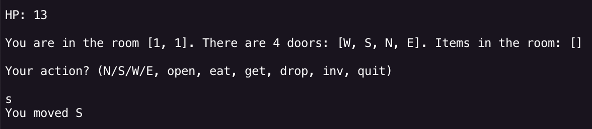
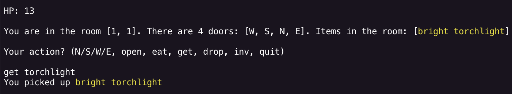
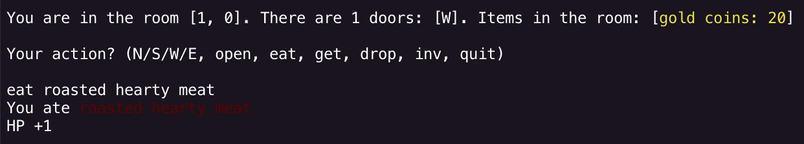
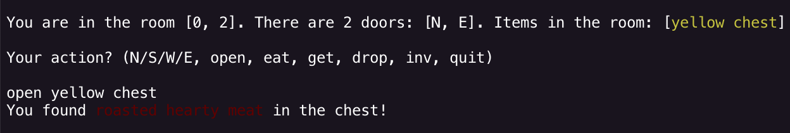

# Crystals and Dragons

A small console roguelike written in **Swift**.
The player explores a labyrinth of rooms, interacts with items, and tries to find the Holy Grail.

---

## 1. How to Run

1. Open your terminal and stretch it to full screen - it will make the game more comfortable to play
   *(I personally recommend using iTerm.)*

2. Navigate to the project directory

3. Run the game:

```
swift run
```

4. Enter the number of rooms to generate the labyrinth (at least 3 rooms)

---

## 2. Gameplay

The game is controlled using **text commands** typed in the terminal.

Available commands:

```
get [item]
drop [item]
open [item]
eat [item]
inv
quit
```

Movement between rooms:

```
N
E
W
S
```
*Each move costs 1 HP*

Important notes:

* Item names must be typed **fully** *(with color)*.
* The only exception is **gold** - you can simply type:

```
get gold
```

Examples:


*move*


*get*


*eat*


*open*

---

## 3. Architecture

The project follows the **MVC (Model-View-Controller)** architectural pattern

**Dependency direction:**

`App -> Controller -> (Model + View)`

`Model` and `View` are fully independent from each other.

### Model

The **Model** contains the core game logic and the domain entities:

* `Game`
* `GameMap`
* `Room`
* `Player`
* `Item`
* `GameState`
* `GameEvent`
* `GameError`

The game world is represented as a **rectangular matrix of rooms (`[[Room]]`)**.
Each room stores its doors and items.

A dedicated **world generator** is responsible for creating the labyrinth and placing items.

All gameplay rules are implemented in the model layer:

* movement and map constraints
* inventory and item interactions
* dark room logic
* torchlight visibility rules
* health and win/loss state transitions

---

### Controller

The **Controller** processes player commands and connects the input with the game logic.

Responsibilities:

* parsing text commands
* calling game logic
* mapping results to view messages
* running the game loop (orchestration only)

The controller does not store business rules of the game world.

---

### View

The **View** is responsible only for **console interaction**:

* printing game messages
* displaying room information
* reading user input

The view layer does not contain any game logic.

The view does not depend on model entities directly.

---
## 4. World Generation

The game world is generated procedurally based on the number of rooms provided by the player.

Several gameplay elements depend on the **size of the labyrinth**.

### Key-Chest Pairs

The number of **key–chest pairs** depends on the total number of rooms.
Larger labyrinths generate more pairs.

Maximum number of pairs: **4**

Each chest can only be opened with the corresponding key.

---

### Grail

One of the chests contains the **Holy Grail**, which is required to win the game.

If a chest does **not** contain the Grail, there is a **33% chance** that it will contain **meat**.

---

### Dark Rooms

There is a **10% chance** that a room will be a **dark room**.

Dark rooms add additional challenge to exploration.

---

### Meat Spawn

There is a **15% chance** that a room will contain **meat**.

Meat can be eaten to restore health.

---
